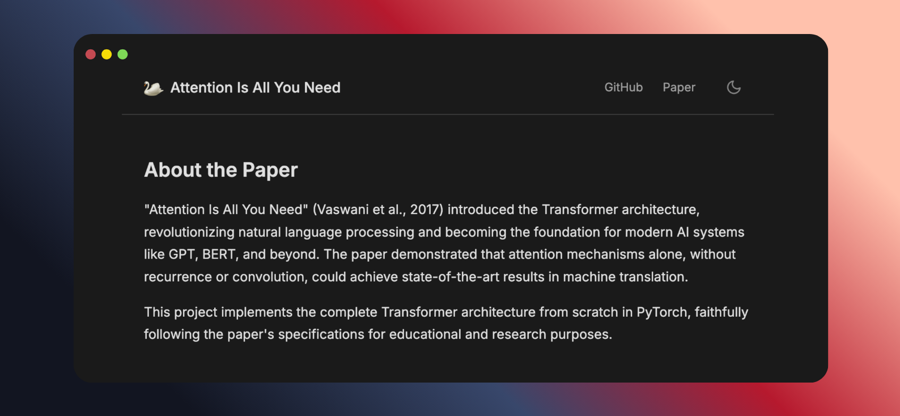

<div align="center">

# Attention Is All You Need

Implements the complete Transformer architecture from scratch in PyTorch [site](https://attention-is-all-you-need.onrender.com/)


</div>

## Installation

```bash
pip install -r requirements.txt
```

## Usage

```python
from src.model import build_transformer

# Build transformer with paper's default hyperparameters
model = build_transformer(
    src_vocab_size=10000,
    tgt_vocab_size=10000,
    src_seq_len=512,
    tgt_seq_len=512,
    d_model=512,
    N=6,
    h=8,
    dropout=0.1,
    d_ff=2048
)
```

## Training

```bash
python src/train.py --config configs/config.yaml
```

## Project Structure

- [`model.py`](src/model.py) - Complete Transformer implementation
- [`dataset.py`](src/dataset.py) - Bilingual dataset handling
- [`train.py`](src/train.py) - Training pipeline

## Citation

```bibtex
@article{vaswani2017attention,
  title={Attention is all you need},
  author={Vaswani, Ashish and Shazeer, Noam and Parmar, Niki and ...},
  journal={NeurIPS},
  year={2017}
}
```

---
<div align="center">
  <p><em>Implemented by AyaNexus 🦢</em></p>
</div>